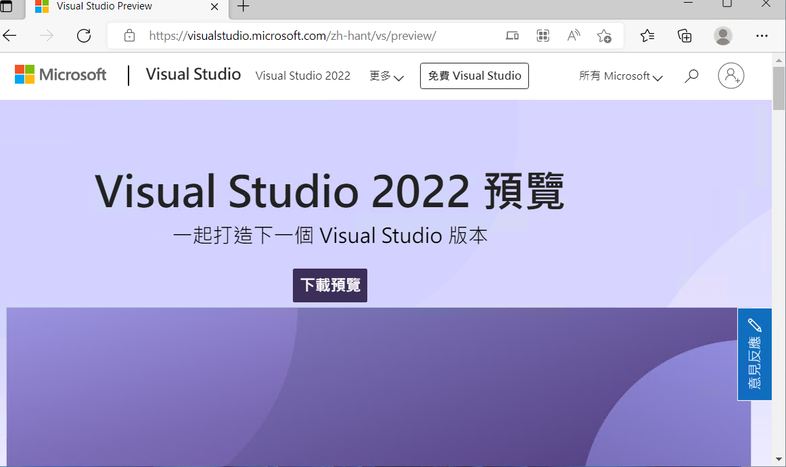
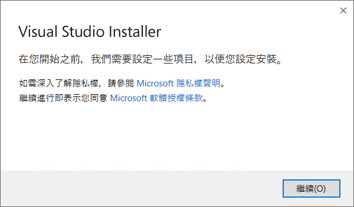
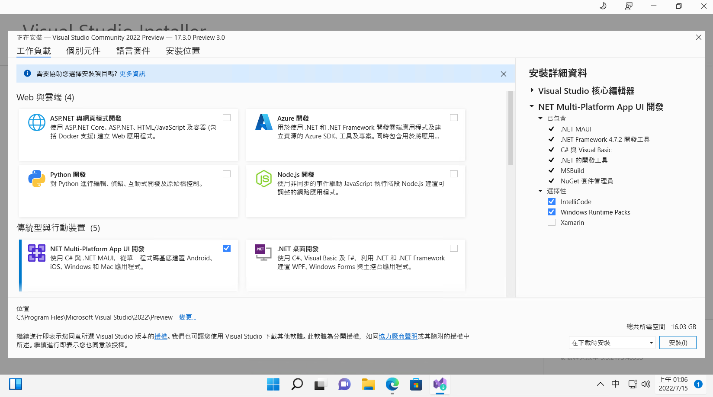
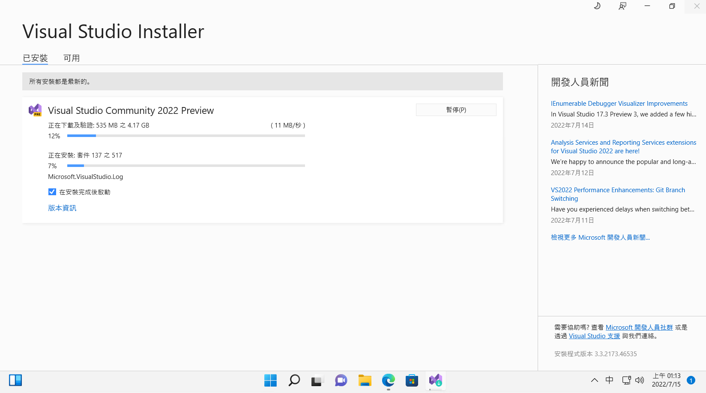
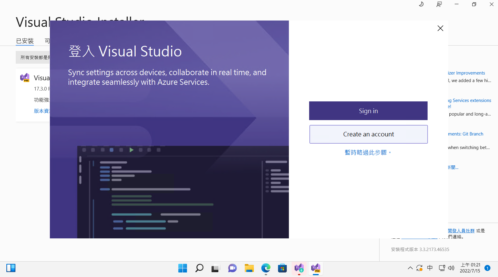
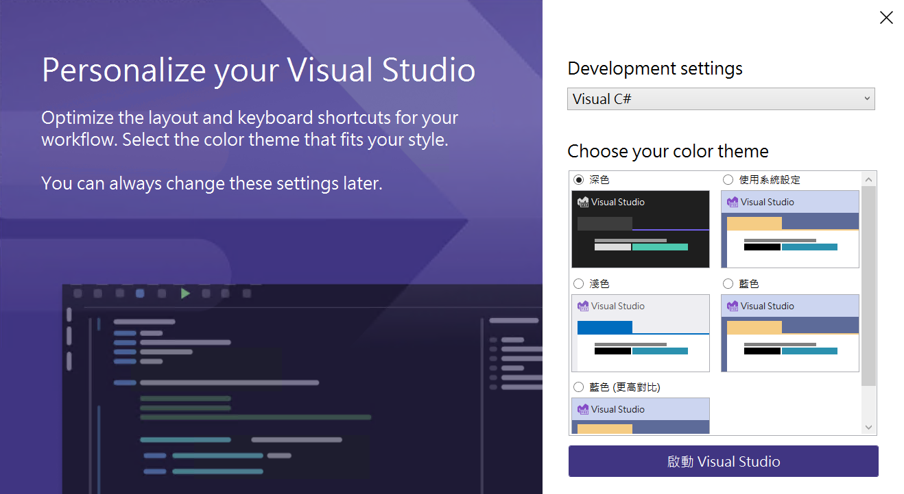
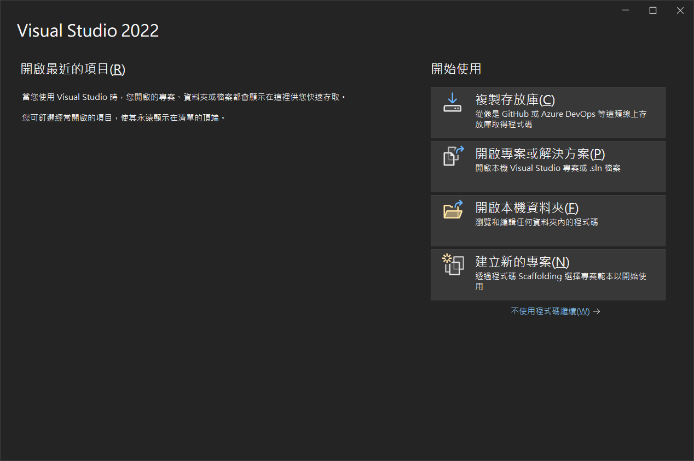
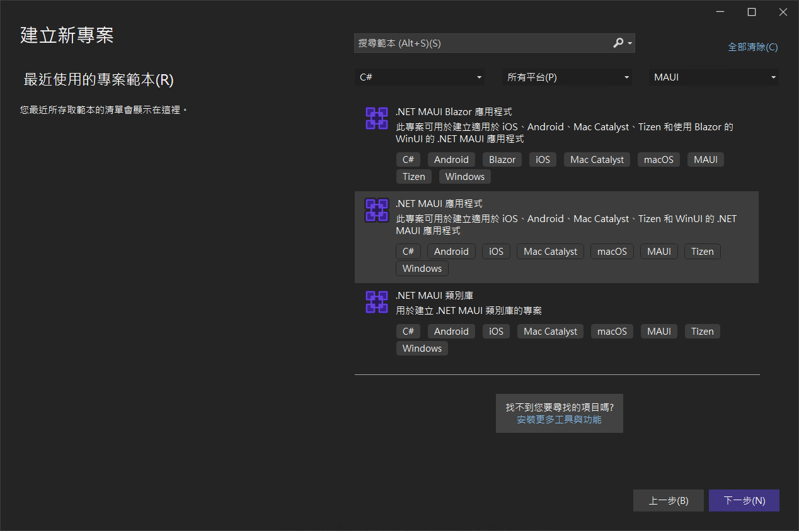

# 第一次體驗與建立 毛伊 MAUI 應用程式

微軟在今年 2022 年推出了 .NET 多平臺應用程式 UI ([.NET MAUI](https://docs.microsoft.com/zh-tw/dotnet/maui/what-is-maui?WT.mc_id=DT-MVP-5002220))，這是一種跨平臺架構，可透過 C# 和 [XAML](https://docs.microsoft.com/zh-tw/dotnet/desktop/wpf/xaml?WT.mc_id=DT-MVP-5002220) 建立原生行動和桌面應用程式，而其中 MAUI 是 Multi-Platform App UI 的縮寫。

其實，有使用過 [Xamarin.Forms](https://docs.microsoft.com/zh-tw/xamarin/xamarin-forms?WT.mc_id=DT-MVP-5002220) 開發過跨平台應用程式的開發者對於 MAUI 應該不會很陌生，因為，他就是 Xamarin.Forms 的下一代進化版本工具，所以，當然是可以透過 MAUI 來開發出 Windows / iOS / Android 的應用程式，除了這三種平台，還可以開發出 macOS 的應用程式。

在這篇文章中將要來體驗看看 MAUI 這個 UI Toolkit 的實際產生過程與專案架構，然而，在這個時間點，想要開發 MAUI 應用程式，必須安裝 Visual Studio 2022 17.3 (Preview) 版本 (現階段 Visual Studio 2022 的正式版本僅推出到 17.2 版本， 17.3 尚在預覽階段)，因此，先透過瀏覽器開啟 [Visual Studio 2022 預覽版](https://visualstudio.microsoft.com/zh-hant/vs/preview?WT.mc_id=DT-MVP-5002220) 下載網址

* 點選網頁上的 [下載預覽] 按鈕
* 當網頁跳到 [試用預覽] 區段的時候，請下載 [Visual Studio Community] 這個版本即可，當然，下載其他的版本也是沒有問題的，其中 [Visual Studio Community] 版本是免費且功能完整的 IDE，適用於學生、開放原始碼參與者以及個別開發人員。
* 請點選 [Visual Studio Community] 右邊的 [下載預覽] 按鈕
* 一旦 VisualStudioSetup.exe 安裝檔案下載完成後，請直接開啟這個檔案
* 在出現 [使用者帳戶控制] 對話窗時候，點選 [是] 按鈕，接受允許此 App 變更您的裝置。
* 看到 [Visual Studio Installer] 對話窗後，點選該對話窗右下方的 [繼續] 按鈕

* 稍微等候一下，將會看到 Visual Studio Community 2022 Preview 安裝程式畫面
* 請勾選 [NET Multi-Platform App UI 開發] 這個選項，其中這個選項的說明內容為：使用 C# 與 .NET MAUI，從單一程式碼基底建置 Android, iOS, Windows 和 Mac 應用程式。

* 完成後，點選右下方的 [安裝] 按鈕
* 現在要稍微等候一段時間，因為安裝程式正在下載與安裝所需要用到的相關檔案

* 當看到底下的畫面，那就表示 Visual Studio 2022 已經安裝完成了

* 在此，點選右邊的 [暫時略過此步驟] 文字
* 建議對於 [Development settings] 的下拉選單控制項，選擇 [Visual C#]
* 對於 [Choose your color theme] 區段，可以依據自己喜好，選擇合適顏色配置主題佈景，在此，我選擇預設值
* 請點選右下方的 [啟動 Visual Studio] 按鈕

* 一旦 Visual Studio 2022 啟動成功後，就會看到 Visual Studio 2022 對話窗
* 請點選右下方的 [建立新的專案] 表示透過程式碼 Scaffolding 選擇專案範本以開始使用

* 當出現 [建立新專案] 對話窗
* 在中間最上方有三個下拉選單控制項
* 切換 [所有語言] 下拉選單控制項為 [C#]
* 切換 [所有專案類型] 下拉選單控制項為 [MAUI]
* 此時，在中間區域將會看到有三種專案範本可以選擇
* 請點選中間那個 [.NET MAUI 應用程式] 此專案可用於建立適用於 iOS、Android、Mac Catalyst、Tizen 和 WinUI 的 .NET MAUI 應用程式
* 最後，點選右下方的 [下一步] 按鈕

?WT.mc_id=DT-MVP-5002220

