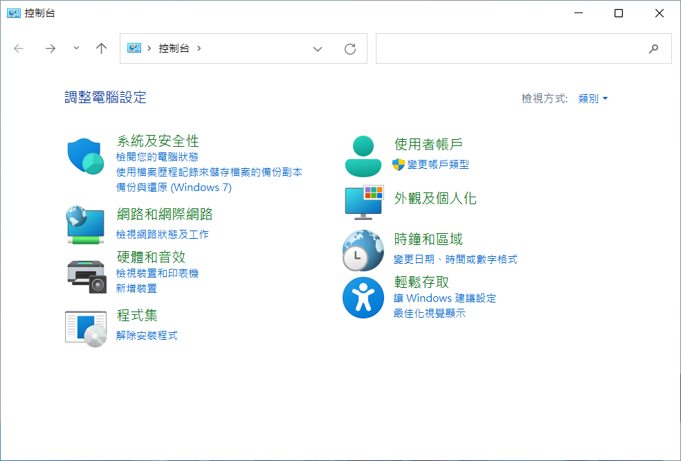
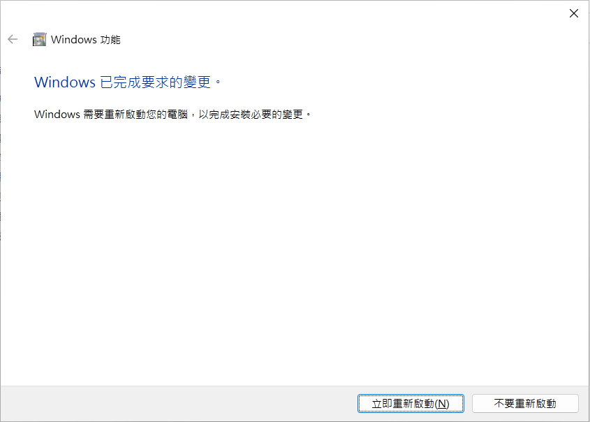
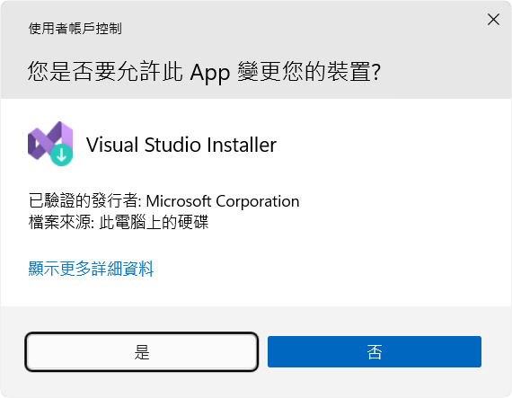
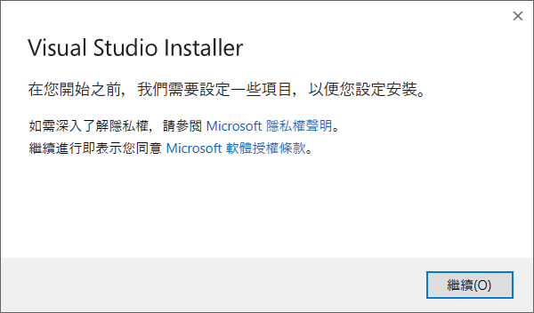
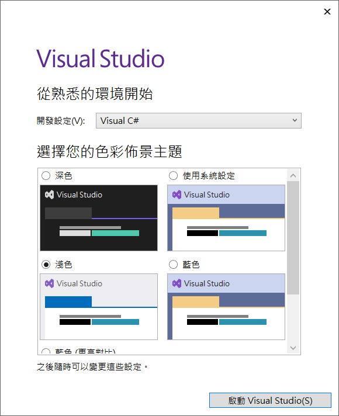

# 安裝與設定 Xamarin.Forms 與 Prism 開發環境教學 (2022年5月)

這篇文章將會在 Windows 11 作業系統底下來進行操作，當然，也可以將 Visual Studio 2022 到 Windows 10 作業系統下。

這裡將會說明如何安裝 Visual Studio 2022 開發工具，並且可以進行 Xamarin.Forms 的專案開發與安裝 Prism Template Pack 這個擴充功能的作法。

## 安裝 Hyper-V 管理員

為了要能夠在本機電腦上跑 Android 模擬器，因此，建議需要安裝 Hyper-V 管理員工具，底下將會說明如何安裝這個工具。

在 Windows 11 工具列上，點選 [開始] 圖示

請在最上方的文字輸入盒內，輸入 [控制台]

點選 [控制台] 圖示，啟動這個應用程式

找到綠色文字的 [程式集] 並點選這個文字

看到 [程式集] 視窗內容後

找到並且點選 [開啟或關閉 Windows 功能] 文字

現在將會顯示出 [Windows 功能] 對話窗

在此對話窗內，找到 Hyper-V 節點

勾選該節點內的所有子節點

接著找到並且勾選這個 [Windows Hypervisor 平台] 節點

最後，點選右下方的 [確定] 按鈕，開始進行安裝這兩個功能

一旦安裝完成之後，請在 [Windows 功能] 對話窗的右下方

找到並且點選 [立即重新啟動] 這個按鈕

## 下載 Visual Studio 2022

更多關於 Visual Studio 2022 的資訊，可以參考 [https://docs.microsoft.com/zh-tw/visualstudio/productinfo/vs-roadmap](https://docs.microsoft.com/zh-tw/visualstudio/productinfo/vs-roadmap?WT.mc_id=DT-MVP-5002220) 這個連結內容。

當電腦重新啟動完成之後，就要開始安裝 Visual Studio 2022 了

首先，請使用瀏覽器打開這個網址 [認識 Visual Studio 系列](https://visualstudio.microsoft.com/zh-hant/) ，找到如下圖的 [認識 Visual Studio 系列] 文字，在其文字下方的最左方將會看到 [Visual Studio] 工具圖示，請點選 [下載 Visual Studio] 這個按鈕，將會看到有三個選項，分別為 [Community 2022]、[Professional 2022]、[Enterprise 2022] 這三個選項。

對於這三種 Visual Studio 2022 開發工具，[Community 2022] 版本是免費使用的，而對於 [Professional 2022]、[Enterprise 2022] 這兩個版本，則是需要付費購買，才能夠使用的。對於要開發 Xamarin.Forms 專案，這三個類型的 Visual Studio 2022 都可以做到，因此，在這篇文章中，將會使用 Visual Studio 2022 Community 這個版本來做說明。

在點選 [下載 Visual Studio] 按鈕後所彈出的子視窗內，點選 [Community 2022] 這個選項。

稍待一段時間，當檔案 [VisualStudioSetup.exe] 下載完成之後，可以從瀏覽器上直接點選並且開啟這個檔案，底下螢幕截圖將會使用 Microsoft Edge 瀏覽器所出現的畫面內容。

## 開始進行安裝 Visual Studio 2022

首先，將會看到 [使用者帳戶控制] 對話窗出現在螢幕上，這裡需要授權且允許這個 Visual Studio Installer 程式可以執行，因此，請點選 [是] 按鈕。

接著，將會看到如下面螢幕截圖的畫面，請在此對話窗內點選 [繼續] 按鈕，以便同意繼續進行安裝 Visual Studio 2022

在此之前，將會從網路取得要安裝 Visual Studio 2022 的最新資訊，一旦 [Visual Studio Installer] 安裝程式準備就緒，就會出現 [正在安裝 Visual Studio Community 2022 - 17.2.0] 對話窗。 

請勾選 [工作負載] > [傳統型與行動裝置] > [使用 .NET 進行行動開發] 這個工作負載選項

請勾選 [工作負載] > [傳統型與行動裝置] > [.NET 桌面開發] 這個工作負載選項

請點選 [個別元件] 標籤頁次，請勾選 [程式碼工具] > [Git for Windows] 這個選項

想要知道這次安裝過程會安裝那些工具到電腦上，可以查看該對話窗最右邊的 [安裝詳細資料] 區域，就會看到相關詳細資料。

最後，點選右下方 [安裝] 按鈕，開始進行 Visual Studio 2022 應用程式

接下來會看到下面截圖畫面，將會一邊下載安裝程式，一邊進行安裝

## 啟動 Visual Studio 2022

一旦安裝完成之後，將會看到如下圖的 [登入 Visual Studio] 視窗出現，在這裡建議使用任何 Microsoft 帳號來登入 Visual Studio，以便可以享受到更多好處。

不過，在這裡，將會先不使用 微軟 帳號登入到 Visual Studio 內，因此，點選最下方的 [不是現在，以後再說] 這個文字連結。

接下來要來設定 Visual Studio 的作業環境操作模式與主題布景

作者個人對於開發設定比較喜歡使用 [Visual C#] 操作模式，因此，請在 [開始設定] 這個文字右方的下拉選單，選擇 [Visual C#] 這個選項

另外對於主題布景部分，作者個人比較偏好 [淺色]，因此，在 [選擇您的色彩佈景主題] 下方，選擇了 [淺色] 這個主題佈景，當然，可以依照個人喜好，選擇自己喜歡的主題佈景，而且日後也可以在 Visual Studio 開發工具內進行切換變更。

現在，可以點選 [啟動 Visual Stuio] 按鈕，進行啟動作業

## 安裝 Prism Template Pack 擴充功能套件

透過 Prism Template Pack 擴充功能套件，可以快速建立與使用 Prism 這個 MVVM 設計模式類別庫，設計出跨平台的 Xamarin.Forms 專案

當 Visual Studio 2022 啟動之後，便會看到下面的對話窗畫面。

現在要來確認安裝好的 Visual Studio 2022 開發工具，是否可以順利開發 Xamarin.Forms 專案

點選右下方的 [不使用程式碼繼續] 文字連結

當 Visual Studio 2022 開發工具視窗顯示之後

點選功能表上的 [延伸模組] > [管理延伸模組] 選項

此時，[管理擴充功能] 的對話窗將會出現

確認最左方的標籤頁次選擇了 [線上] 這個頁次

在右上方的搜尋文字輸入盒內輸入 `Prism Template Pack`

現在可以在該對話窗的正中央清單中的第一個，看到 [Prism Template Pack] 這個項目

點選這個項目最右方的 [下載] 按鈕

當 [Prism Template Pack] 下載完成之後

從最下方的黃底黑色文字可以看到

> 您的變更將進行排程。修改作業將會在全部 Microsoft Visual Studio 個視窗都關閉後開始進行。

因此，依據指示，點選該對話窗右下方的 [關閉] 按鈕

緊接著關閉 Visual Studio 2022

稍微等候一下，將會看到 [VSIX Installer] 對話窗出現

請點選該對話窗右下方的 [Modify] 按鈕

等候 Prism Template Pack 擴充功能安裝完畢

當看到下面對話窗的截圖，點選右下方的 [Close] 按鈕

## 安裝開發 Xamarin.Forms 專案用到的加速開發程式碼片段

使用瀏覽器打開 [https://github.com/vulcanlee/XamarinProductive](https://github.com/vulcanlee/XamarinProductive) GitHub Repository

在右方看到一個 [Code] 按鈕，點選下去

可以選擇 Clone 這個 Repository 到本機上，或者下載這個 Repository Zip 檔案，並且在本機電腦上解壓縮這個壓縮檔案

重新開啟 Visual Studio 2022 開發工具

當 Visual Studio 2022 啟動對話窗顯示時候

點選右下方的 [不使用程式碼繼續] 文字連結，直接開啟 Visual Studio 2022

當看到 Visual Studio 2022 開發工具視窗後

點選功能表 [工具] > [程式碼片段管理員]

現在將會看到 [程式碼片段管理員] 對話窗出現

在上方的 [語言] 文字下方的下拉選單 Combobox ，切換選擇 [CSharp] 這個項目

接著點選下方的 [加入] 按鈕

現在將會出現 [程式碼片段目錄] 對話窗

請切換到剛剛下載下來的 XamarinProductive Repository 目錄下，找到並且選擇 [CodeSnippetV2] 這個目錄

之後點選右下方的 [選擇資料夾] 按鈕

此時，將會回到 [程式碼片段管理員] 對話窗

在中間清單區域，將會看到 [CodeSnippetV2] 這些程式碼片段已經安裝完成了

請點選右下方的 [確定] 按鈕

完成後，請關閉 Visual Studio 2022 程式

## 建立一個 Xamarin.Forms 專案

啟動 Visual Studio 2022 ，便會看到下面的對話窗畫面。

現在要來確認安裝好的 Visual Studio 2022 開發工具，是否可以順利開發 Xamarin.Forms 專案

點選右下方的 [建立新的專案] 按鈕

現在將會看到 [建立新專案] 對話窗出現在螢幕上

在最右上方的 [所有專案類型] 下拉選單中，選擇 [行動裝置]

從中間的清單中，將會看到 [Prism Blank App (Xamarin.Forms)] 項目，請點選這個項目

接著，點選右下方的 [下一步] 按鈕

此時會看到 [設定新的專案] 對話窗出現在螢幕上

在這裡僅是要做測試之用，因此，點選右下方的 [建立] 按鈕

畫面上將會顯示 [PRISM PROJECT WIZARD] 這個對話窗

請勾選 [ANDROID] & [iOS] 這兩個選項

取消 [UWP] 這個選項

接著，在下方的 [Container] 下拉選單控制項內，選擇 [Unity] 這個項目

最後，點選右下方的 [CREATE PROJECT] 按鈕

## 第一次開啟 Xamarin.Forms Server 專案

一旦 Visual Studio 成功建立 Xamarin.Forms 專案，並且是第一次開始，則會出現底下的 [Windows 安全性警訊] 對話窗，請點選右下方的 [允許存取] 按鈕

此時，該專案已經打開了

在 [方案總管] 視窗中，找到 [BlankApp1.Android] 這個專案

使用滑鼠右集這個專案節點

選擇 [設定為起始專案] 選項

## 設定與更新 Android SDK

點選功能表 [工具] > [Android] > [Android SDK Manager]

允許開啟 Android SDK Manager

由於是第一次開啟，因此在 [Android SDK 及工具] 對話窗下

將會顯示另外一個 [SDK 需要修復] 對話窗

請點選右下方 [修復] 按鈕

因為要安裝 Android SDK 與模擬器用到的程式

將會看到 [接受授權] 對話窗出現

請點選右下方的 [接受] 按鈕

由於安裝會需要一些時間，因此，可以觀察 [Android SDK 及工具] 對話窗最下方的狀態進度列與文字，以便知道是否已經安裝完畢

安裝完成之後，便可以關掉 [Android SDK 及工具] 對話窗

## 建立與設定 Android 模擬器

點選功能表 [工具] > [Android] > [Android Device Manager]

允許開啟 Android Device Manager

當 [Android Device Manager] 對話窗出現之後

點選右上方的 [+ New] 按鈕

將會出現 [New Device] 對話窗

使用預設值來建立一個模擬器

請點選右下方的 [Create] 按鈕

現在出現 [接受授權] 對話窗

請點選右下方 [接受] 按鈕

現在將會正在下載該模擬器影像檔案到這台電腦上

一旦下載完成後

請點選 [Start] 按鈕，啟動該模擬器

底下是模擬器啟動後的畫面

## 在 Android 模擬器上執行 Xamarin.Forms 專案

現在要來啟動這個 Xamarin.Forms 專案，請在 Visual Studio 2022 最上方找到深綠色三角形，在該三角形右方將會顯示這個 Android App 將會在哪個 Android 實體裝置或者模擬器上執行，從下圖中可以看出，這個 App 將會於 API 30 (Android 11.0 - API 30) 這個裝置來執行。

點選這個按鈕，以便啟動這個 Xamarin.Forms 專案，並且進入除錯模式

Visual Studio 2022 將會開始編譯與建置這個 Android 專案

一旦沒有發現到任何錯誤

將會在模擬器上執行這個 App

底下是執行完成後的畫面

